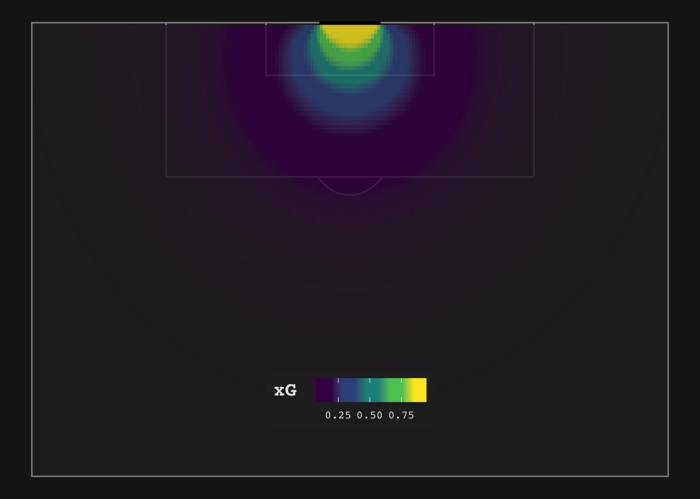
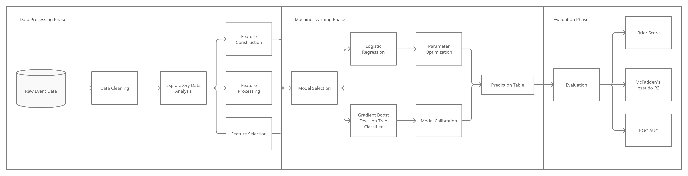

	<h1>Expected Goals (xG) Model</h1>
  
<b>A machine learing model to predict the expected goals (xG) of each shot taken on a football field.</b>

	
	 
	 
	 

## What Are Expected Goals (xG)?

Expected goals (or xG) measures the quality of a chance by calculating the likelihood that it will be scored from a particular position on the pitch during a particular phase of play. This value is based on several factors from before the shot was taken. xG is measured on a scale between zero and one, where zero represents a chance that is impossible to score and one represents a chance that a player would be expected to score every single time.

 
 

## Architecture Diagram

 
 

## Data Used
- Wyscout Data (open-source)

## Machine Learning Algorithm Used
- Logistic Regression
- Decision Tree Method (extreme gradient boost)

## Evaluation Metric Used
- The Brier score 
- McFadden's pseudo-R2
- Receiver operating characteristics (ROC)  